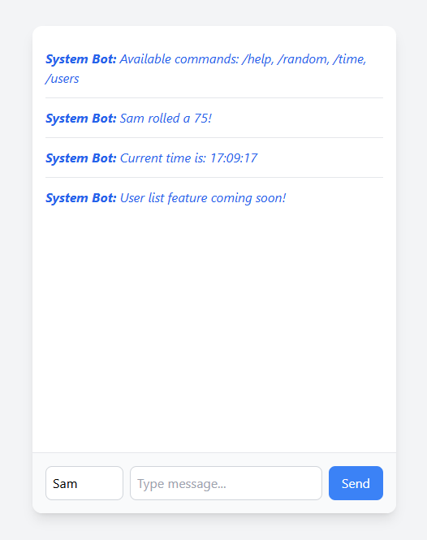

# real-time-chat-app

A full-stack real-time chat application built with Node.js, Express, and Socket.IO, featuring instant messaging, typing indicators, and interactive commands.

[](screenshots/main-chat.png)
[](screenshots/typing-indicator.png)
[](screenshots/command-demo.png)


## Current features

- **Real-time messaging** with WebSocket connections
- **Typing indicators** showing when others are typing
- **Interactive commands**:
  - `/help` - Show available commands
  - `/random` - Generate a random number (1-100)
  - `/time` - Display current time
  - `/users` - User list placeholder
- **Message history** with in-memory persistence
- **Responsive UI** built with Tailwind CSS

## Expected features

- **Docker containerization** for easy deployment

## Tech Stack

- **Backend**: Node.js, Express.js, Socket.IO
- **Frontend**: HTML5, Tailwind CSS, Vanilla JavaScript
- **Deployment**: Docker

### Installation
1. Clone the repository:
   ```
   git clone https://github.com/your-username/real-time-chat-app.git
   cd real-time-chat-app
   ```
2. Install dependencies:
   ```
   npm install
   ```
3. Start the development server:
   ```
   npm run dev
   ```

4. Open your browser and navigate to http://localhost:3000


   
